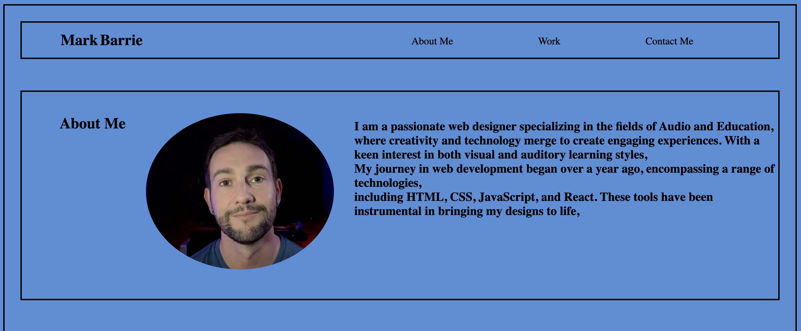
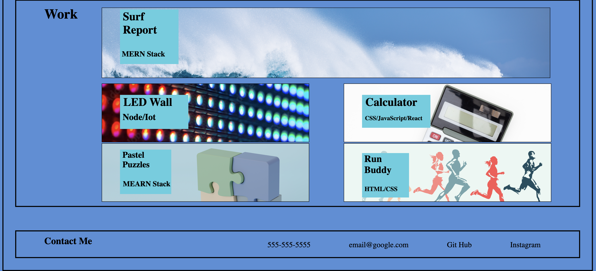

# Portfolio Website

# Week 2 Challenge - Portfolio Webpage

## Description

The goal of this project was to create a resopnsive web page featuring a Header with navigation to sections on the page, an About Me section with a picture and description, Work section with Clickable pictures to their respective applications, and a Contact section with clickable links.

My biggest challenge was in the CSS and responsiveness. 

I learned a lot about how to plan ahead and to begin testing responsiveness from the very first element. I also utilized the Chrome developer tools alot to help analyze elements within the webpage. 

## Usage
[Click here for website](https://mbarrie1979.github.io/Portfolio_2/)

Click on the top menu to navigate to different sections of the webpage. 

## Credit
Mark Barrie - Developer
Photos - Adobe 

